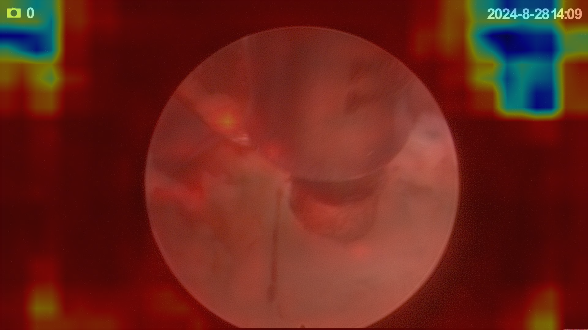
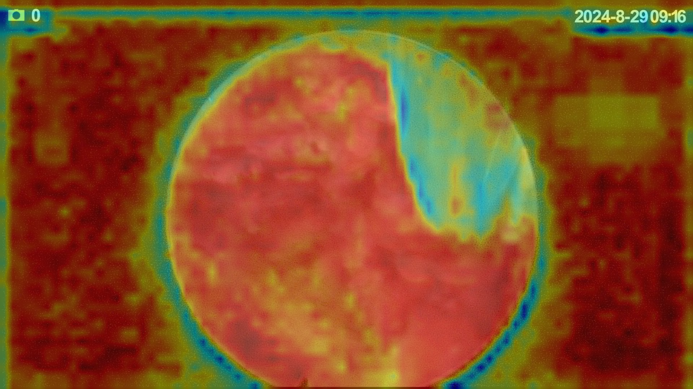
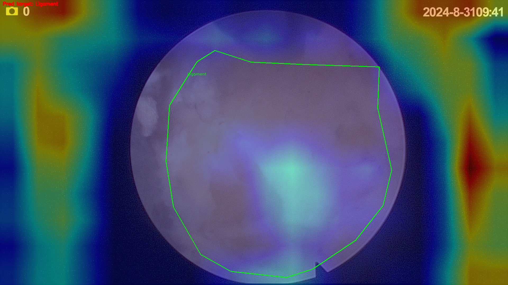
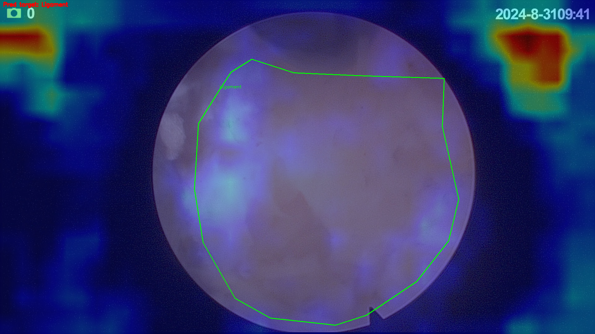
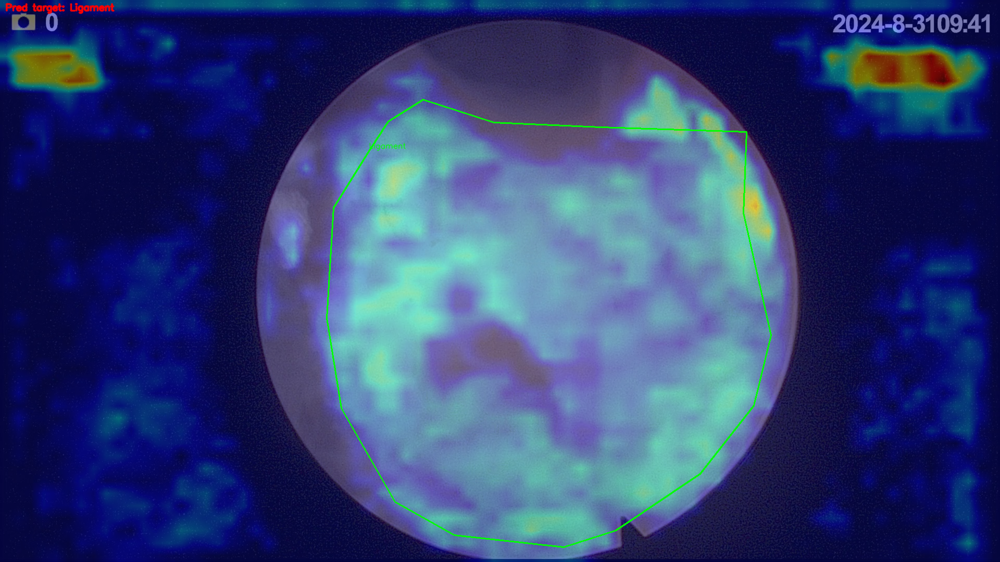
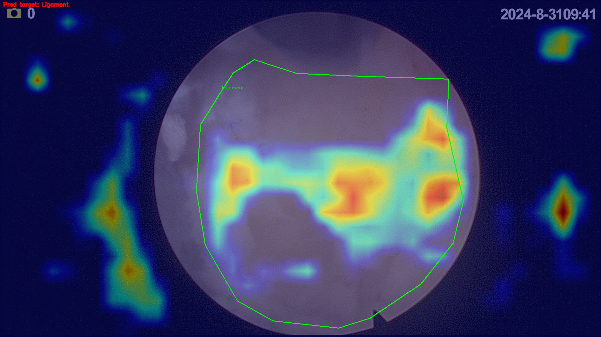
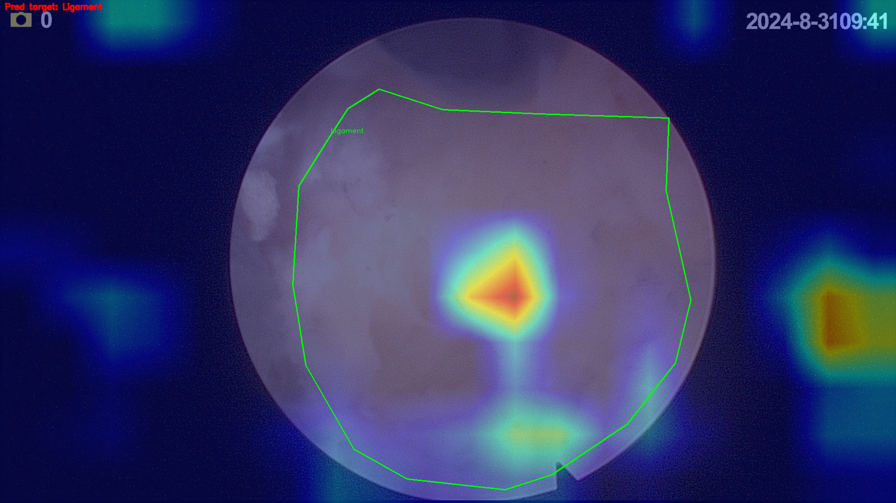
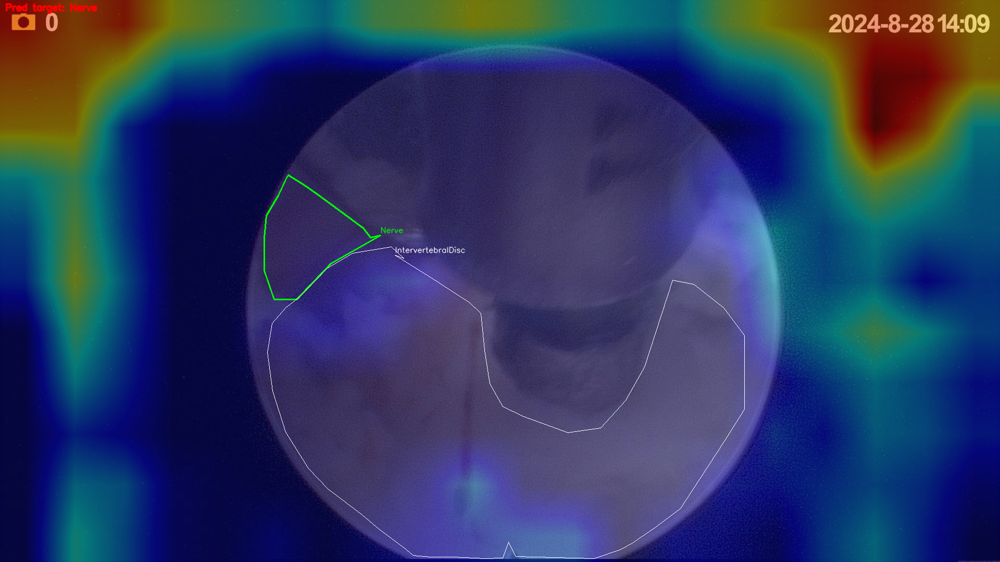
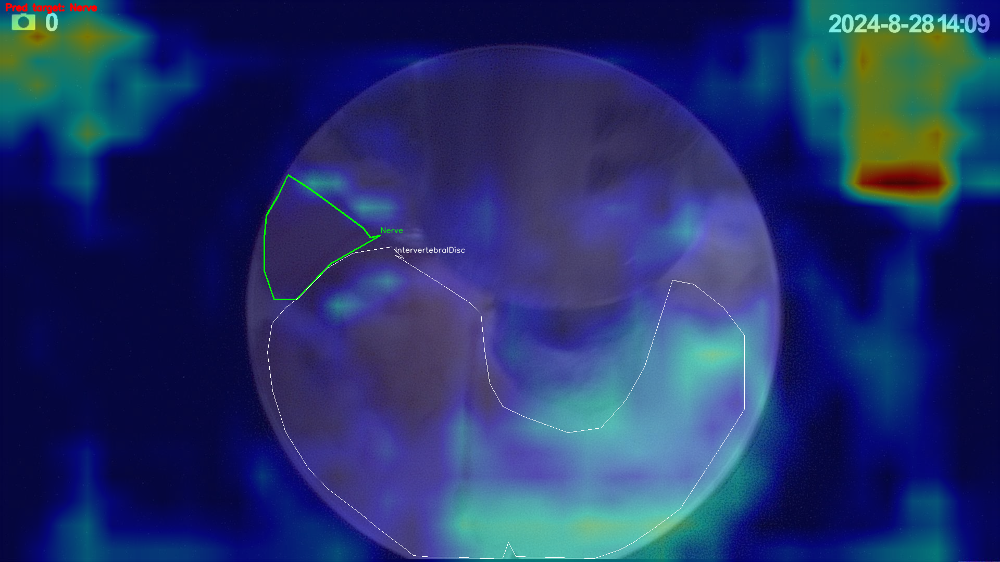
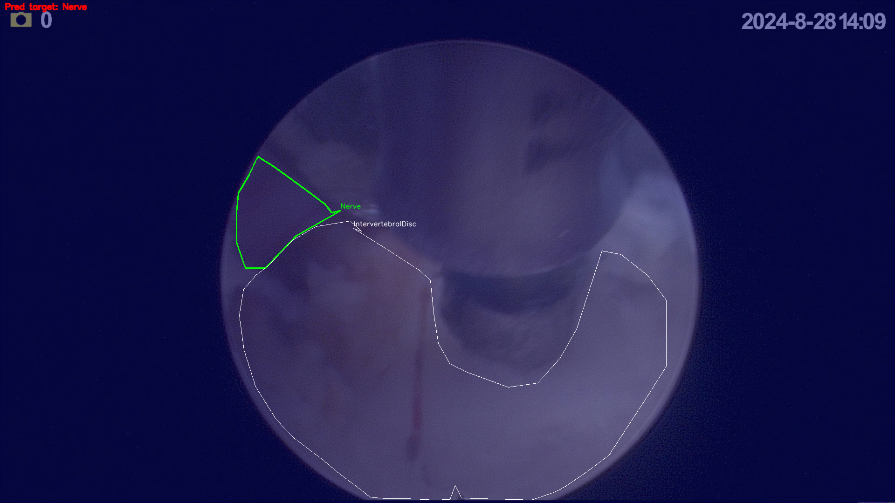

# Attention Visualization

Qualitative validation of the thesis's core quantitative finding: does position, not
just mechanism, shape what the attention modules actually learn to attend to?

## Method 1: EigenCAM

EigenCAM was implemented first, ahead of a gradient-based Grad-CAM, for a practical
reason specific to this architecture. Grad-CAM relies on backward hooks through the
target layer to weight activations by class-score gradients; that's fragile against
the reshape-heavy, multi-branch operations inside these custom attention wrappers
(pooling/reshaping in Coordinate Attention, the triple-branch permutations in Triplet
Attention), where a gradient hook can silently break or misattribute across a reshape
boundary. EigenCAM sidesteps this entirely: it takes the first principal component
(via SVD) of the raw forward activations at a layer, with no backward pass and no
dependence on how the layer's internals are wired internally. It trades class
discriminativeness (EigenCAM highlights "what the layer responds to," not "what
drove this specific class prediction") for robustness: the right trade for first
verifying the visualization pipeline itself is trustworthy before asking it a harder
question. See Method 2 below for the gradient-based follow-up.

## Layers visualized

Confirmed by direct model inspection (`model.model.model[idx]`), same indices used
throughout the rest of the repo:

| Layer | Mechanism | Role |
|---|---|---|
| L15 | C2CA (Coordinate Attention) | FPN fusion, feeds a downstream attention layer |
| L19 | C2Triplet | Segmentation-head input (P3, 80×80) |
| L23 | C2Triplet | Segmentation-head input (P4, 40×40) |

Weights: `Hybrid-L15CA`, seed 1 (`.../hybrid/yolo11n_seg_c2triplet_c2ca_15_seed1/weights/best.pt`),
the paper's headline configuration.

## Pipeline notes

Inference goes through `model.predict()` directly rather than a reimplemented resize,
so the visualized input exactly matches real evaluation: Ultralytics' actual
rectangular-inference letterboxing (pads to the nearest stride-32 multiple, not a
naive square resize). The real input tensor is captured via a forward hook on
`model.model.model[0]`, and the letterbox padding region is detected by scanning for
Ultralytics' pad constant (114/255) rather than recomputed from source-image geometry;
for this dataset's fixed 1920×1080 source resolution, content consistently lands at
rows[12:372] of the 640×384 model input.

Each layer's activation is cropped to the content region before EigenCAM's SVD is
computed, so the heatmap isn't diluted by padding. No further region is excluded:
the full content region, overlay included, feeds the SVD (see Finding 4 for what
that shows about the overlay).

Heatmaps from different layers are resized to a common shape (`cv2.INTER_AREA`,
smallest layer's resolution) before any cross-layer comparison, since L15/L19/L23
have different native spatial resolutions.

## Concentration metric

Localization is scored with the normalized participation ratio:

```
concentration = (sum(heatmap))^2 / (N * sum(heatmap^2))
```

Range (0, 1]: closer to `1/N` means the heatmap is sharply localized to a few pixels;
closer to `1` means activation is spread near-uniformly across the layer. This gives a
single comparable number per layer per frame, independent of the heatmap's raw scale.

## Findings

**1. L15 (Coordinate Attention): widest concentration range (0.26–0.98), content-dependent.**
Its localization varies substantially with frame content, plausibly consistent with
CA's architecture: separate height-pooled and width-pooled descriptors combined via
outer product, which can sharpen or diffuse depending on what's actually in each
strip.

**2. L19 (Triplet Attention): anomalously stable (0.94–0.98), largely content-independent.**
The least content-reactive of the three layers regardless of what's in the frame,
suggesting this position learns closer to a uniform recalibration than a sharp
spatial gate. An overlay-artifact explanation was tested and ruled out (see Finding 4
and the masking ablation below): the stability isn't a measurement artifact.

**3. L23 (Triplet Attention): wide range (0.43–0.98), despite identical mechanism to L19.**
This is the load-bearing qualitative result: the *same* attention mechanism at a
different pyramid position behaves differently. It corroborates the thesis's core
quantitative finding (position, not mechanism, determines effectiveness; see main
`README.md`, L19 vs. L23 vs. L27 ablation) through an independent method.

**4. Separate finding: content-invariant positional bias toward the overlay location.**
All three layers show heatmap activity anchored to the fixed timestamp/camera-icon
overlay position. To test whether this was driven by the overlay's actual pixel
content, the overlay regions were cropped/masked from the source frame before
inference; the heatmap still activated at the same top-left/top-right positions
(see the masking-ablation example below), ruling out "the model is reacting to the
overlay's visible pixels" as the explanation. Since the overlay sat at an identical
position in every training frame, the more likely explanation is that the network
learned to treat those spatial locations as expected/anchor features independent of
what's actually rendered there. This is a real deployment caveat, not a training bug:
footage without this exact overlay wasn't part of training and this behavior is
untested against it. It's a separate finding from #2 above (content-invariance for a
known, explainable reason, vs. L19's stability which is a genuine property of the
mechanism) and is documented as a caveat in the main README's Limitations section.

## Example overlays

**Cross-layer comparison** (same frame, `9-1_Video5_24320`): L15 and L23 show sharp, localized hotspots; L19 shows a broad, near-uniform response despite an identical mechanism to L23:

<table>
<tr>
<td><br><sub>L15 (C2CA)</sub></td>
<td><br><sub>L19 (C2Triplet)</sub></td>
<td><br><sub>L23 (C2Triplet)</sub></td>
</tr>
</table>

**L19 stability across frames**: the near-uniform response in the table above persists on a second, different frame, supporting Finding 2:


<br><sub>L19 (C2Triplet), frame 10-1_10_Video2_00057</sub>

**Overlay masking ablation** (Finding 4): the same frame with the overlay regions cropped/masked from the source before inference; the heatmap still activates at the same top-left/top-right positions, showing the model anchors to those spatial locations regardless of what's actually rendered there:


<br><sub>L19 (C2Triplet), frame 10-1_10_Video2_00057, overlay masked</sub>

## Method 2: Grad-CAM

Class-discriminative attribution, addressing what EigenCAM can't: which pixels drove
the model's confidence in one specific structure, not just what a layer responds to
in general. Implemented once EigenCAM had independently verified the pipeline
mechanics above (letterbox handling, content-region detection).

**Target definition.** For each frame, one heatmap is generated per anatomical class
actually present in that frame's ground-truth label, not a single fixed class
across all frames. The backprop target is the maximum raw (pre-NMS) confidence score
for that class, taken directly from `model.model()`'s output rather than
`model.predict()` (which runs under `torch.no_grad()` and would break backprop
entirely). Standard Grad-CAM combine from there: global-average-pool the gradient at
each layer into a per-channel weight, weighted-sum the layer's forward activations,
ReLU, normalize; reusing the same content-crop, resize-to-common, and concentration
pipeline already verified under EigenCAM.

**Verification.** Every target confidence is cross-checked against
`model.predict()`'s reported confidence for the same class on the same frame; across
the 10 comparable pairs run so far (one target, at 0.0006 raw confidence, had no
matching `model.predict()` detection to compare against), the two agree to within
0.0000–0.0022, confirming the raw-output class-confidence channel is indexed
correctly.

**Ground-truth localization metric.** In addition to the concentration score, each
heatmap is scored against its frame's GT polygon(s) for the target class:
gt_overlap = (heatmap mass inside the GT polygon) / (total heatmap mass)

Range [0, 1]. Closer to 1 means the heatmap's energy is concentrated inside the
annotated structure; closer to 0 means it's landing elsewhere in the frame
(including the corner/background regions described below).

**Important limitation: L27 zero-gradient artifact, not a finding.** L27 shows
exactly-zero heatmaps for Nerve and IntervertebralDiscHerniation specifically (4 of
its 11 target/frame combinations), never for the four larger structures. This was
initially suspected to be a real signal about L27's attention behavior, mirroring the
paper's own L27 null result, but per-channel weight inspection showed the weights
are exactly `0.000000` in every zero case, not merely negative. This is a structural
consequence of the simplified single-max-anchor target: the backprop target is the
single best-scoring anchor across all 5040 anchors spanning three independent scale
branches (P3/L19, P4/L23, P5/L27, with no cross-branch connection at the head). A max
over independent branches routes gradient to exactly one winning branch, so whenever
the globally-best anchor for a class comes from P3 or P4, L27 is mathematically
guaranteed zero gradient for that frame, regardless of what L27's attention
mechanism actually does. Since small/thin structures (Nerve, Herniation) are
disproportionately matched to fine-resolution anchors during YOLO's training-time
assignment, this pattern will recur most runs. **This says nothing about L27's
localization quality and should not be cited as corroborating the L27 ablation
finding**: it's a scope limitation of the simplified max-anchor target, documented
here so it isn't mistaken for a result later.

**Numbers so far** (6 frames, 11 target/frame combinations, 55 layer×class rows:
a small, illustrative sample, not a statistical one; see `outputs_gradcam/results.csv`
for every row):

| Layer | Mean GT overlap | n |
|---|---|---|
| L19 (C2Triplet) | 0.211 | 11 |
| L23 (C2Triplet) | 0.160 | 11 |
| L27 (MSCA) | 0.135 | 7, excludes Nerve/Herniation, see limitation above |
| L15 (C2CA) | 0.143 | 11 |
| L11 (MSCA) | 0.103 | 11 |

| Class | Mean GT overlap | n |
|---|---|---|
| Ligament | 0.363 | 5 |
| IntervertebralDisc | 0.200 | 15 |
| IntervertebralDiscHerniation | 0.149 | 8 |
| Muscle | 0.082 | 10 |
| Nerve | 0.079 | 8 |
| Skeleton | 0.057 | 5 |

One row (`IntervertebralDiscHerniation` at 0.0006 raw confidence, frame
`10-1_10_Video6_00103`) reflects a class the model essentially didn't detect in that
frame; its heatmap direction is not a meaningful "attention" signal and is excluded
from interpretation, though it remains in the CSV for completeness.

### Example overlays

**Best-localization example**: Ligament, frame `1_1_part1_Video1_06677`, across all
five layers. L23 and L19 show the strongest overlap (0.643 and 0.550); L11 and L27
weaker but still substantially inside the annotated region:

<table>
<tr>
<td><br><sub>L11 (MSCA), overlap 0.100</sub></td>
<td><br><sub>L15 (C2CA), overlap 0.141</sub></td>
<td><br><sub>L19 (C2Triplet), overlap 0.550</sub></td>
<td><br><sub>L23 (C2Triplet), overlap 0.643</sub></td>
<td><br><sub>L27 (MSCA), overlap 0.379</sub></td>
</tr>
</table>

**Weak-localization contrast**: Nerve, frame `9-1_Video5_24320`. L11 and L23 both
show genuinely low overlap (real, gradient-driven, just landing elsewhere in frame;
note the corner hot spots outside the endoscope circle, consistent with the
overlay-position bias documented under EigenCAM's Finding 4):

<table>
<tr>
<td><br><sub>L11 (MSCA), overlap 0.001</sub></td>
<td><br><sub>L23 (C2Triplet), overlap 0.002</sub></td>
</tr>
</table>

**The L27 zero-gradient artifact, same frame**: for contrast with the two images
above, this isn't "even weaker localization" but a completely flat heatmap (no
color at all), which is the visual signature of the artifact described in the
limitation above:


<br><sub>L27 (MSCA), Nerve: zero gradient (all channel weights exactly 0), not a localization result</sub>

## Reproducing

**EigenCAM:**
```bash
python gradcam/run_eigencam.py
```
Reads frames from `gradcam/frames/`, writes overlays to `gradcam/outputs/`, and
prints per-layer concentration scores to stdout.

**Grad-CAM:**
```bash
python gradcam/run_gradcam.py
```
Reads the same frames plus their YOLO-seg polygon labels from `gradcam/labels/`
(same stem, `.txt`), generates one heatmap per annotated class per frame, writes
overlays to `gradcam/outputs_gradcam/`, and writes per-row concentration/confidence/
GT-overlap numbers to `gradcam/outputs_gradcam/results.csv`.

Both require a CUDA-capable `torch` install (fall back to CPU if unavailable, but
will be slow).