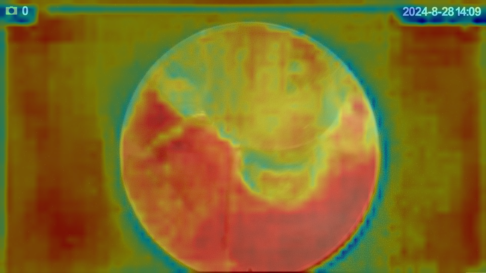
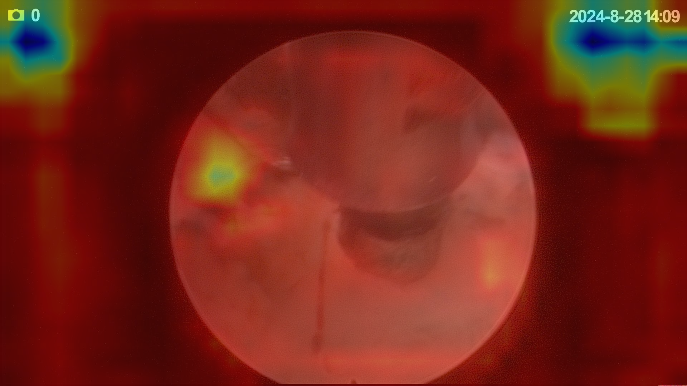
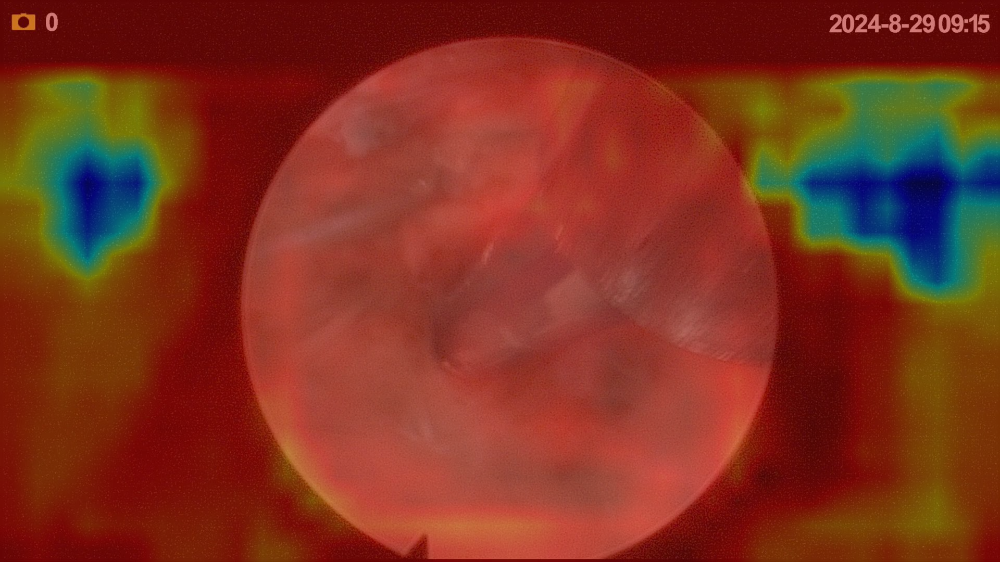

# Attention Visualization

Qualitative validation of the thesis's core quantitative finding: does position, not
just mechanism, shape what the attention modules actually learn to attend to?

## Method: EigenCAM (Grad-CAM proper not yet implemented)

EigenCAM was implemented first, ahead of a gradient-based Grad-CAM, for a practical
reason specific to this architecture. Grad-CAM relies on backward hooks through the
target layer to weight activations by class-score gradients — that's fragile against
the reshape-heavy, multi-branch operations inside these custom attention wrappers
(pooling/reshaping in Coordinate Attention, the triple-branch permutations in Triplet
Attention), where a gradient hook can silently break or misattribute across a reshape
boundary. EigenCAM sidesteps this entirely: it takes the first principal component
(via SVD) of the raw forward activations at a layer, with no backward pass and no
dependence on how the layer's internals are wired internally. It trades class
discriminativeness (EigenCAM highlights "what the layer responds to," not "what
drove this specific class prediction") for robustness — the right trade for first
verifying the visualization pipeline itself is trustworthy before asking it a harder
question. See the stub below for the follow-up.

## Layers visualized

Confirmed by direct model inspection (`model.model.model[idx]`), same indices used
throughout the rest of the repo:

| Layer | Mechanism | Role |
|---|---|---|
| L15 | C2CA (Coordinate Attention) | FPN fusion — feeds a downstream attention layer |
| L19 | C2Triplet | Segmentation-head input (P3, 80×80) |
| L23 | C2Triplet | Segmentation-head input (P4, 40×40) |

Weights: `Hybrid-L15CA`, seed 1 (`.../hybrid/yolo11n_seg_c2triplet_c2ca_15_seed1/weights/best.pt`)
— the paper's headline configuration.

## Pipeline notes

Inference goes through `model.predict()` directly rather than a reimplemented resize,
so the visualized input exactly matches real evaluation: Ultralytics' actual
rectangular-inference letterboxing (pads to the nearest stride-32 multiple, not a
naive square resize). The real input tensor is captured via a forward hook on
`model.model.model[0]`, and the letterbox padding region is detected by scanning for
Ultralytics' pad constant (114/255) rather than recomputed from source-image geometry
— for this dataset's fixed 1920×1080 source resolution, content consistently lands at
rows[12:372] of the 640×384 model input.

Each layer's activation is cropped to the content region before EigenCAM's SVD is
computed, so the heatmap isn't diluted by padding. No further region is excluded —
the full content region, overlay included, feeds the SVD (see Finding 4 for what
that shows about the overlay).

Heatmaps from different layers are resized to a common shape (`cv2.INTER_AREA`,
smallest layer's resolution) before any cross-layer comparison, since L15/L19/L23
have different native spatial resolutions.

## Concentration metric

Localization is scored with the normalized participation ratio:

```
concentration = (sum(heatmap))^2 / (N * sum(heatmap^2))
```

Range (0, 1]: closer to `1/N` means the heatmap is sharply localized to a few pixels;
closer to `1` means activation is spread near-uniformly across the layer. This gives a
single comparable number per layer per frame, independent of the heatmap's raw scale.

## Findings

**1. L15 (Coordinate Attention) — widest concentration range (0.26–0.98), content-dependent.**
Its localization varies substantially with frame content, plausibly consistent with
CA's architecture: separate height-pooled and width-pooled descriptors combined via
outer product, which can sharpen or diffuse depending on what's actually in each
strip.

**2. L19 (Triplet Attention) — anomalously stable (0.94–0.98), largely content-independent.**
The least content-reactive of the three layers regardless of what's in the frame,
suggesting this position learns closer to a uniform recalibration than a sharp
spatial gate. An overlay-artifact explanation was tested and ruled out (see Finding 4
and the masking ablation below) — the stability isn't a measurement artifact.

**3. L23 (Triplet Attention) — wide range (0.43–0.98), despite identical mechanism to L19.**
This is the load-bearing qualitative result: the *same* attention mechanism at a
different pyramid position behaves differently. It corroborates the thesis's core
quantitative finding (position, not mechanism, determines effectiveness — see main
`README.md`, L19 vs. L23 vs. L27 ablation) through an independent method.

**4. Separate finding — content-invariant positional bias toward the overlay location.**
All three layers show heatmap activity anchored to the fixed timestamp/camera-icon
overlay position. To test whether this was driven by the overlay's actual pixel
content, the overlay regions were cropped/masked from the source frame before
inference — the heatmap still activated at the same top-left/top-right positions
(see the masking-ablation example below), ruling out "the model is reacting to the
overlay's visible pixels" as the explanation. Since the overlay sat at an identical
position in every training frame, the more likely explanation is that the network
learned to treat those spatial locations as expected/anchor features independent of
what's actually rendered there. This is a real deployment caveat, not a training bug:
footage without this exact overlay wasn't part of training and this behavior is
untested against it. It's a separate finding from #2 above (content-invariance for a
known, explainable reason, vs. L19's stability which is a genuine property of the
mechanism) and is documented as a caveat in the main README's Limitations section.

## Example overlays

**Cross-layer comparison** (same frame, `9-1_Video5_24320`) — L15 and L23 show sharp, localized hotspots; L19 shows a broad, near-uniform response despite an identical mechanism to L23:

<table>
<tr>
<td><br><sub>L15 (C2CA)</sub></td>
<td><br><sub>L19 (C2Triplet)</sub></td>
<td><br><sub>L23 (C2Triplet)</sub></td>
</tr>
</table>

**L19 stability across frames** — the near-uniform response in the table above persists on a second, different frame, supporting Finding 2:


<br><sub>L19 (C2Triplet), frame 10-1_10_Video2_00057</sub>

**Overlay masking ablation** (Finding 4) — the same frame with the overlay regions cropped/masked from the source before inference; the heatmap still activates at the same top-left/top-right positions, showing the model anchors to those spatial locations regardless of what's actually rendered there:


<br><sub>L19 (C2Triplet), frame 10-1_10_Video2_00057, overlay masked</sub>

## Reproducing

```bash
python gradcam/run_eigencam.py
```

Reads frames from `gradcam/frames/` (6 approved frames, all classes covered), writes
overlays to `gradcam/outputs/`, and prints per-layer concentration scores to stdout.
Requires a CUDA-capable `torch` install (the script falls back to CPU if unavailable,
but will be slow).

## Grad-CAM (proper) — not started

A gradient-weighted, target-score-based Grad-CAM was deferred until EigenCAM's
pipeline mechanics (letterbox handling, content-region detection, overlay-artifact
handling) were independently verified and trusted — they now are, per the findings
above. Grad-CAM would add class-discriminative attribution (which pixels drove a
specific class's score, not just what the layer responds to in general) but requires
backward hooks through each mechanism's reshape-heavy internals, which is the
fragility EigenCAM was chosen to avoid first. Next step for this repo.
